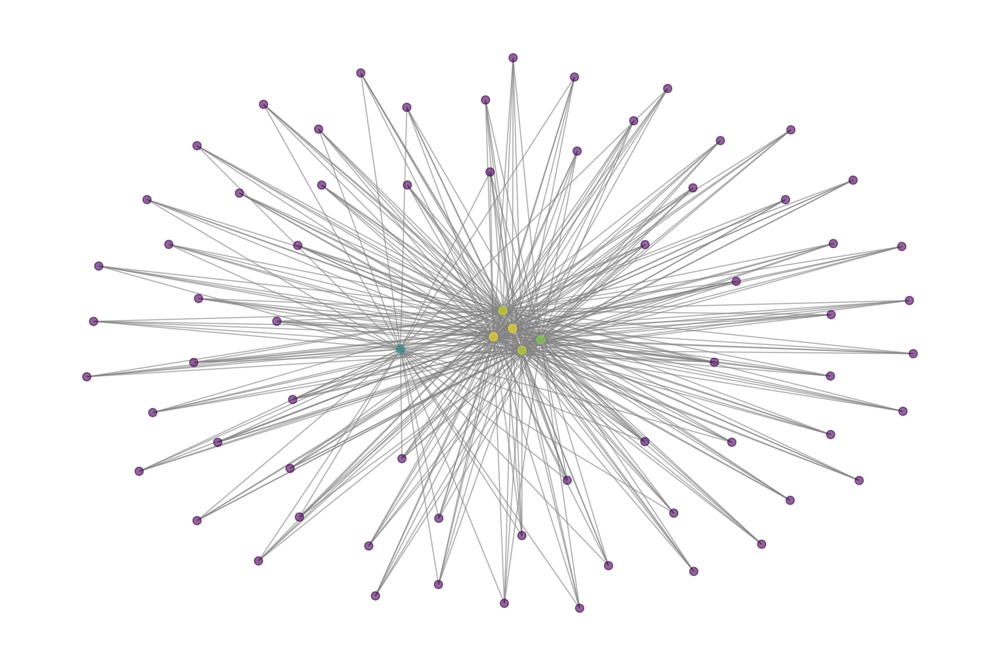

#  A Graph-Based Approach for Identifying At-Risk Users in Mental Health Communities Using Google PageRank

## **🔍 Project Overview**
This project analyzes **mental health communities** by combining **Google PageRank** with **sentiment analysis** to **identify at-risk users**.  
We use **graph-based analysis** to understand how mental health conversations spread and who the **most influential users** are.

The goal is to:
- Identify **highly influential users** in online mental health communities.
- Detect **at-risk users** based on **sentiment analysis**.
- Merge these insights to find **critical users who are both highly influential and at-risk**.

---

---

## **Workflow Explanation**
### **🔹 Step 1: Data Preprocessing (`data_preprocessing.py`)**
-  Loads raw mental health data (Depression, Anxiety, PTSD, etc.).
-  Cleans missing values and pre-processes text features.
-  Saves cleaned datasets in `/data/processed/`.

---

### **🔹 Step 2: Graph Construction & PageRank Analysis (`graph_construction.py`)**
-  Builds a **user interaction graph**, where:
  - **Nodes** = Users
  - **Edges** = Interactions between users (replies, mentions).
-  Computes **Google PageRank** to **rank the most influential users**.
-  Applies **Louvain Community Detection** to find user groups.

  **Key Files:**  
- `user_pagerank_scores.csv` → PageRank scores of users.  
- `community_assignments.csv` → Users grouped into communities.  

---

### **🔹 Step 3: Graph Visualization (`graph_visualization.py`)**
-  **Merged multiple graphs into one large graph** to visualize the network.
-  **Filtered low-degree nodes** to focus on **strongly connected users**.
-  **Created a visualization** to show the network structure.

 **Graph Example:**  
  

 **Key Files:**  
- `graph_visualization.py` → Code for visualizing the graph  
- `fixed_filtered_graph.png` → Graph image  

---

### **🔹 Step 4: Sentiment Analysis (`sentiment_analysis.py`)**
-  Uses **TextBlob** to analyze **sentiment** in user posts.
-  Identifies users with **negative sentiment**, labeling them as **at-risk users**.
-  Saves the list of **at-risk users**.

 **Key Files:**  
- `sentiment_analysis.py` → Code for sentiment analysis  
- `at_risk_users.csv` → List of users with negative sentiment  

---

### **🔹 Step 5: Identifying Critical At-Risk Users (`identify_critical_users.py`)**
-  Combined **PageRank scores (influence) with sentiment analysis**.
-  Identified **users who are both influential AND at risk**.
-  These are the **most critical users to monitor**, as they can impact others negatively.

 **Key Files:**  
- `identify_critical_users.py` → Code for merging PageRank & sentiment analysis  
- `critical_at_risk_users.csv` → Final list of high-risk influential users  

---

##  Key Results & Findings
1️ **Graph Analysis Shows Key Influencers**  
- Some users have **high PageRank scores**, making them **highly influential**.  
- Community detection reveals **clusters of users who interact frequently**.

2️ **Negative Sentiment Users Are Identified**  
- Many users in **Depression & SuicideWatch groups** exhibit **highly negative sentiment**.  
- These users **may need mental health support**.

3️ **High-Risk Influential Users Found**  
- Some **top influencers ALSO have negative sentiment**.  
- These users **could impact others negatively**.  

